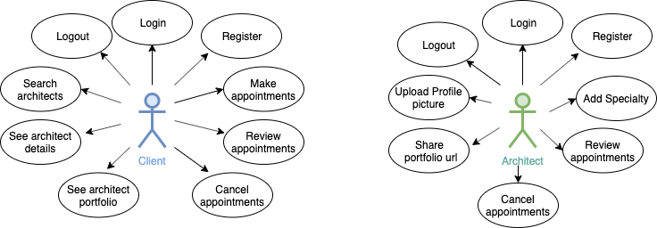
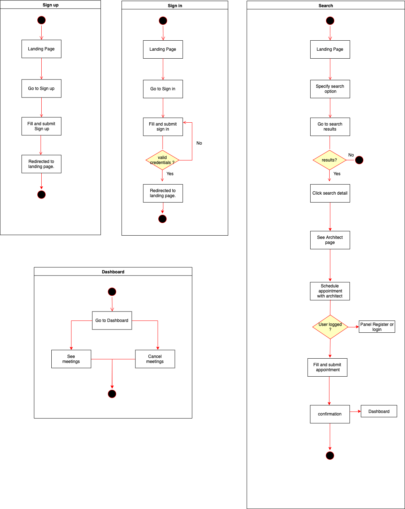
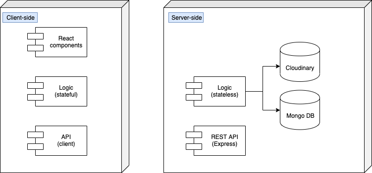
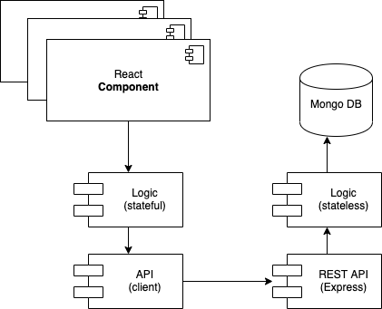
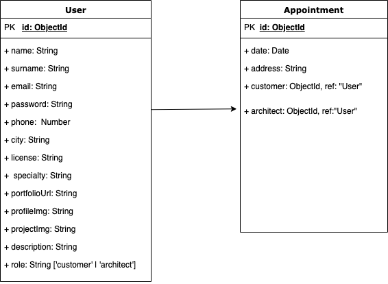
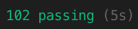
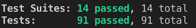

# Jamba 

Project by: 

 - Sylvain Le Grill

 Developped in: 
 - Skylab Coders Academy.

## Introduction

Jamba (jamb in Spanish,  from French *jambe* = "leg") in architecture is the side-post  of a door or window opening;
a door cannot stands on its own , jambs provides support, so do Jamba.

Jamba is a webservice and online marketplace offering to connect directly landlords and tenants to freelance architects for their construction or renovation projects.
 
 Don't fear the architecture world anymore.

## Functional documentation

### Description

Once  registed and logged, customers can: 
- Search for architects
- See architects' profile and portfolio
- Arrange a meeting.
- Retrieve/delete meetings' info and architect's contacts
- Delete  meetings.

Architects, on their side, can: 
- On registration, architects must create a profile including a link to their portfolio and a profile picture.
- Retrieve meetings' info and customer's contacts

### Use cases

### Flows

## Technical documentation

### Technologies

Javascript, ReactJS, Node.js, Express, MongoDB, Mongoose, SASS , Cloudinary. Testing: Jest & Mocha/Chai

### Blocks

### Components

### Data models

### Code coverage

 \
 

\

## Future Versions

- Architects: Edit and delete Profile informations, Upload pictures projects. 
- Customers: Edit and delete Profile informations.
- Improve management task and busy time in Calendar.
- Integrate Google suggestion and maps for meeting address.

## Trello 

[Visit Jamba Trello](https://trello.com/b/eOvepuLd/jamba)