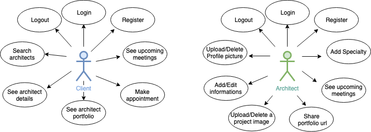
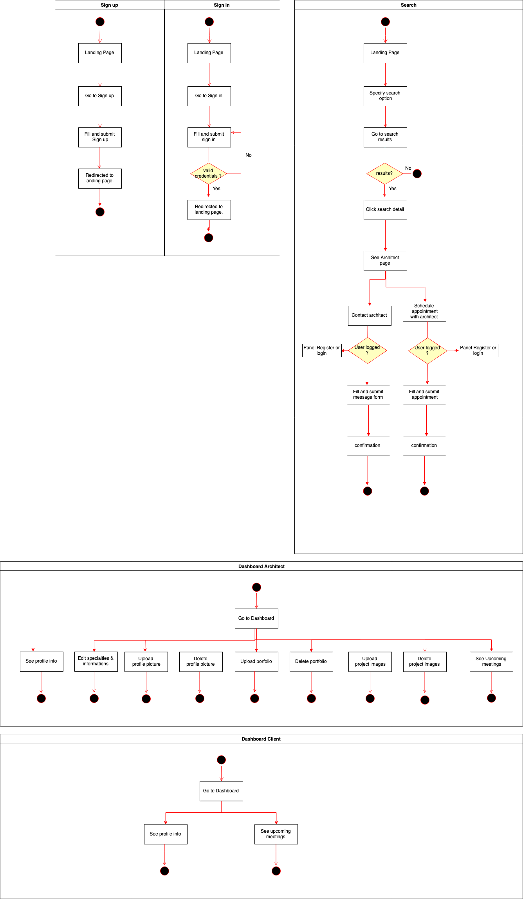

# Jamba 

Project by: 

 - Sylvain Le Grill

 Developped in: 
 - Skylab Coders Academy.

## Introduction

Jamba (jamb in Spanish,  from French *jambe* = "leg") in architecture is the side-post  of a door or window opening;
a door cannot stands on its own , jambs provides support, so do Jamba.

Jamba is a webservice and online marketplace offering to connect directly landlords and tenants to freelance architects for their construction or renovation projects. Don't fear the architecture world anymore.

## Functional documentation

### Description

Users not registered or logged are able to:
- Search for architects living in their city and corresponding to their needs. 
- See architect profiles.

Additionaly, once logged users can: 
- Contact architects
- Arrange a meeting.

Architects, on their side, have the possibility to: 
- Manage their profile by adding a description, images of their last projects, and a pdf of their portfolio.
- They should also be able to see when and where are their next appointments.

### Use cases

### Flows

## Trello 

[Visit Jamba Trello](https://trello.com/b/eOvepuLd/jamba)